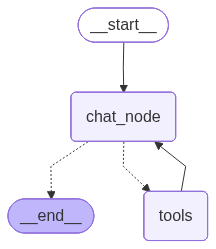

# Omnichat

A multi-tool conversational AI assistant built with **LangGraph**, **LangChain**, and **Streamlit**. Omnichat is a persistent chatbot that can search the web, do math, look up live stock prices, and place simulated stock trades — with a human-in-the-loop approval step before any "purchase" is executed.

---

## Selected Use Case

**A personal finance & research assistant.**

Omnichat lets a user hold a natural conversation while the agent autonomously decides when to reach for tools. The chosen use case combines:

- **General research** — answering questions using live web search.
- **Quick calculations** — basic arithmetic without leaving the chat.
- **Market data** — fetching the latest stock quote for any ticker.
- **Guarded actions** — simulating a stock purchase that requires explicit human approval before it is "executed."

Conversations are saved per-thread, so the user can leave, come back, pick an old thread from the sidebar, and continue exactly where they left off.

---

## Tools Used

The agent is bound to the following tools and decides on its own when to call them:

| Tool | Purpose |
| --- | --- |
| `search_tool` (DuckDuckGo) | Live web search for up-to-date information. |
| `calculator` | Performs `add`, `sub`, `mul`, `div` on two numbers. |
| `get_stock_price` | Fetches the latest quote for a stock symbol via Alpha Vantage. |
| `purchase_stock` | Simulates a stock purchase, **pausing for human approval** before confirming (human-in-the-loop). |

---

## Tech Stack

- **[LangGraph](https://langchain-ai.github.io/langgraph/)** — agent orchestration, state, checkpointing, and human-in-the-loop interrupts.
- **[LangChain](https://python.langchain.com/)** — LLM, tool, and message abstractions.
- **[OpenAI](https://platform.openai.com/)** — the underlying chat model (`ChatOpenAI`).
- **[Streamlit](https://streamlit.io/)** — the chat web UI with token streaming and thread management.
- **SQLite** — durable conversation storage via LangGraph's `SqliteSaver` checkpointer.
- **[LangSmith](https://smith.langchain.com/)** *(optional)* — tracing and observability.

---

## APIs Integrated

| API | Used For | Key Required |
| --- | --- | --- |
| **OpenAI API** | LLM reasoning and responses. | `OPENAI_API_KEY` |
| **Alpha Vantage API** | Live stock price quotes (`GLOBAL_QUOTE`). | `ALPHA_VANTAGE_API_KEY` |
| **DuckDuckGo Search** | Web search (no API key needed). | — |
| **LangSmith API** *(optional)* | Tracing & monitoring of agent runs. | `LANGSMITH_API_KEY` |

---

## LangGraph Workflow Explanation

Omnichat is built as a classic **ReAct-style agent loop** using a `StateGraph`.



### State

The graph state holds the running conversation. The `add_messages` reducer appends new messages instead of overwriting them, so the full history is preserved across turns:

```python
class ChatState(TypedDict):
    messages: Annotated[list[BaseMessage], add_messages]
```

### Nodes

- **`chat_node`** — invokes the LLM (with tools bound). The model either replies directly or emits one or more tool calls.
- **`tools`** — a prebuilt `ToolNode` that executes whichever tool(s) the model requested.

### Edges

1. `START → chat_node` — every turn begins at the LLM.
2. `chat_node → (conditional)` — `tools_condition` inspects the LLM output:
   - If the model requested a tool → route to **`tools`**.
   - Otherwise → route to **`END`** and return the answer.
3. `tools → chat_node` — tool results are fed back to the LLM so it can reason over them and produce a final reply (or call another tool).

This loop repeats until the model responds without requesting any tool, at which point the turn ends.

### Human-in-the-Loop

The `purchase_stock` tool calls LangGraph's `interrupt()`, which **pauses the graph** and surfaces an approval prompt to the UI. The user clicks **Approve** or **Decline**, and the frontend resumes the graph with a `Command(resume=decision)`. Only an explicit "yes" confirms the simulated purchase.

---

## Memory Implementation

Memory is handled by LangGraph's **`SqliteSaver` checkpointer**, backed by a local `chatbot.db` SQLite file:

```python
conn = sqlite3.connect("chatbot.db", check_same_thread=False)
checkpointer = SqliteSaver(conn=conn)
chatbot = graph.compile(checkpointer=checkpointer)
```

- **Per-thread memory** — every conversation is identified by a `thread_id` (a UUID). All messages and graph state for that thread are checkpointed to SQLite.
- **Persistence across sessions** — because state lives on disk, conversations survive app restarts. On launch, `get_all_threads()` reads existing threads from the checkpointer and lists them in the sidebar.
- **Resuming conversations** — selecting a thread reloads its full message history via `chatbot.get_state(...)`, and any paused human-in-the-loop interrupt for that thread is restored too.
- **Interrupt durability** — because the interrupt is part of the checkpointed state, a pending approval is not lost if the page reloads.

---

## How to Run the Application

### 1. Prerequisites

- Python 3.10+
- An [OpenAI API key](https://platform.openai.com/)
- A free [Alpha Vantage API key](https://www.alphavantage.co/support/#api-key)

### 2. Clone & install dependencies

```bash
git clone <your-repo-url>
cd omnichat

# (recommended) create a virtual environment
python -m venv venv
# Windows
venv\Scripts\activate
# macOS / Linux
source venv/bin/activate

pip install -r requirements.txt
```

### 3. Configure environment variables

Copy the example file and fill in your keys:

```bash
# Windows
copy .env.example .env
# macOS / Linux
cp .env.example .env
```

Then edit `.env`:

```env
OPENAI_API_KEY="sk-..."
ALPHA_VANTAGE_API_KEY="your-alpha-vantage-key"

# Optional — enables LangSmith tracing
LANGSMITH_TRACING="true"
LANGSMITH_ENDPOINT="https://api.smith.langchain.com"
LANGSMITH_API_KEY="lsv2_pt_..."
LANGSMITH_PROJECT="omnichat-project"
```

### 4. Launch the app

```bash
streamlit run streamlit_frontend.py
```

The app opens in your browser (default: `http://localhost:8501`). Use **New Chat** to start a fresh thread, or click any thread in the sidebar to resume it.

---

## Example Prompts

Try these to exercise each tool:

**Web search**
> What are the latest headlines about the Federal Reserve interest rate decision?

**Calculator**
> What is 1499 multiplied by 37?

**Stock price lookup**
> What's the current price of AAPL?
>
> Compare the latest prices of TSLA and MSFT.

**Multi-step reasoning (combines tools)**
> Get the current price of NVDA and calculate how much 15 shares would cost.

**Human-in-the-loop purchase**
> Buy 10 shares of AAPL.

> _The agent will pause and ask for approval. Click **✅ Approve** to confirm the simulated purchase, or **❌ Decline** to cancel._

**Memory / context**
> My name is Alex.
>
> _(later in the same thread)_ What's my name?

---

## Project Structure

```
omnichat/
├── langgraph_backend.py    # LangGraph agent: tools, state, nodes, graph, checkpointer
├── streamlit_frontend.py   # Streamlit chat UI, streaming, thread & interrupt handling
├── requirements.txt        # Python dependencies
├── .env.example            # Template for required API keys
├── omnichat-flow.png       # Diagram of the LangGraph workflow
├── chatbot.db              # SQLite store (auto-created on first run)
└── README.md
```
